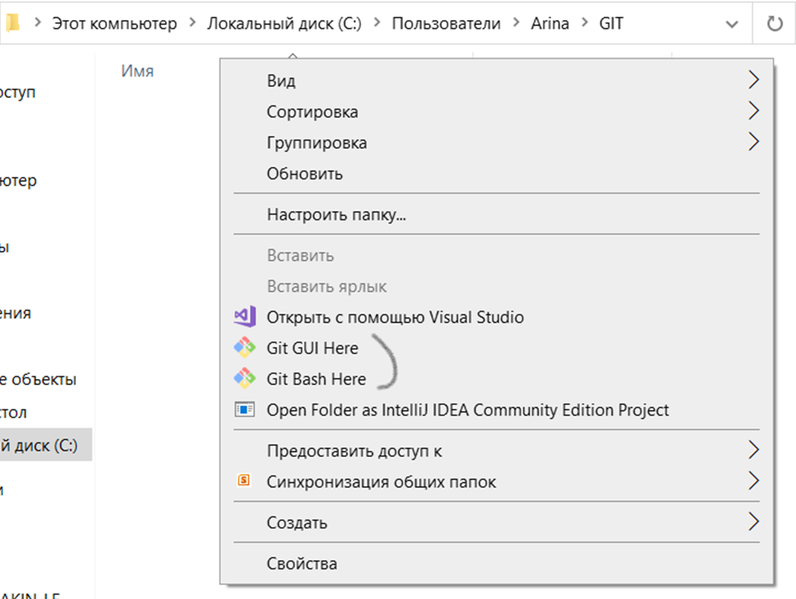
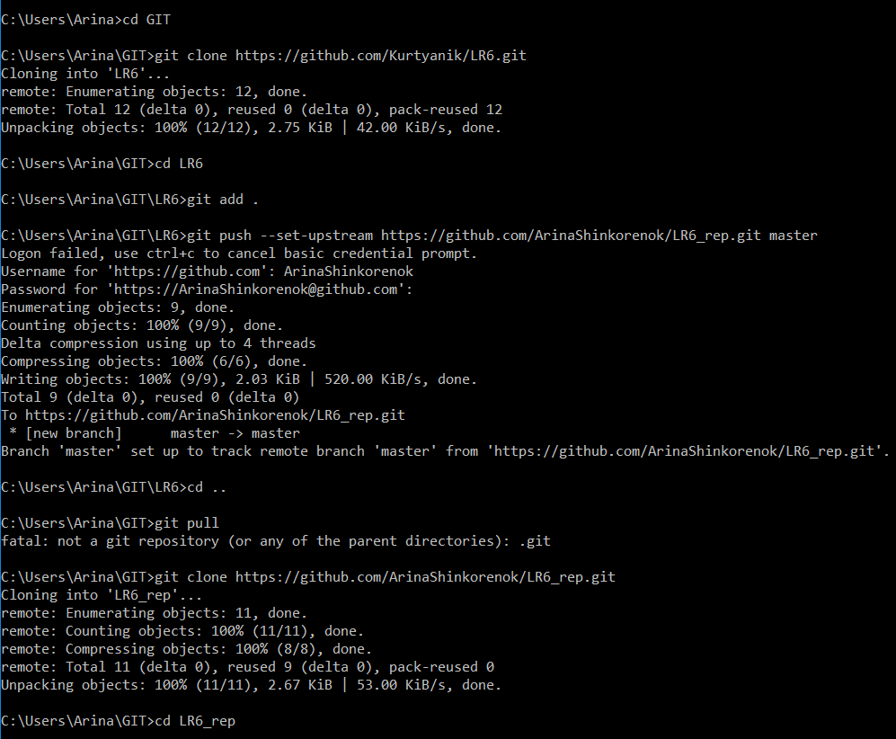
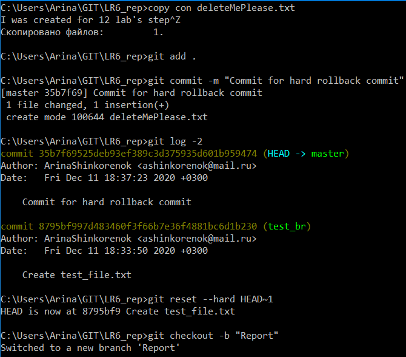
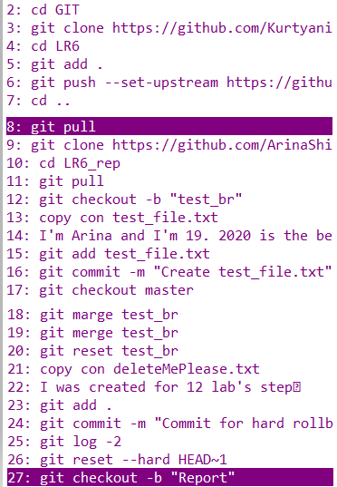

# LR6
# Arina Shinkorenok 4916
## Лабораторная работа №6

Создала аккаунт на GitHub

На моём компьютере уже была установлена система контроля версий, поэтому заново ставить и давать имя пользователю я не стала

Склонировала репозиторий https://github.com/Kurtyanik/LR6.git в свой репозиторий на своём аккаунтке. Добавила файл File_1. Склонировала репозиторий себе на компьютер. На сайте GitHub создала файл File_2 и подтянула изменения на локальное устройство.

Создала ветку test_br. Создала файл test_file.txt и записала в него текст. Затем закоммитела файл в ветку. Выполнила слияние этой побочной ветки и главной. Удалила ветку. 

Создала ещё один файл, закоммитила его и выполнила "хард" коммит. Создала ветку "Отчёт".

В ветку Report закоммитила папку со скриншотами

История комманд, которые я использовала во время выполнения лабораторной

